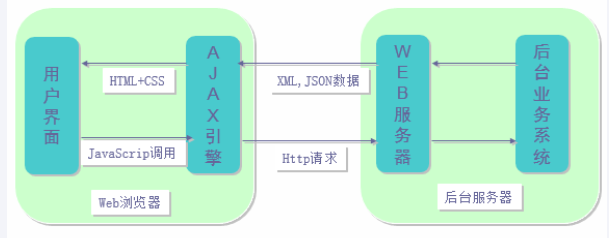

#阶段考试  --- jQuery 和 ajax 参考答案

1. nodejs的优缺点是什么？
	- Node.js优点：
		1. 采用事件驱动、异步编程，为网络服务而设计。
		2. Node.js非阻塞模式的IO处理给Node.js带来在相对低系统资源耗用下的高性能与出众的负载能力。
		3. Node.js轻量高效，可以认为是数据密集型实时应用系统的完美解决方案。
		4. js语言适合前端工程师上手。
		5. 社区活跃发展速度快
	- Node.js缺点：
		1. 单进程，单线程，只支持单核CPU，不能充分的利用多核CPU服务器。
		2. 对程序员要求高一旦当前进程崩掉，那么整个web服务就崩掉了。
		3. 不适合做复杂很高的计算
		

2. 什么是事件循环
	- Node采用的是单线程的处理机制（所有的I/O请求都采用非阻塞的工作方式），至少从Node.js开发者的角度是这样的。 
	而在底层，Node.js借助libuv来作为抽象封装层， 从而屏蔽不同操作系统的差异，Node可以借助 libuv 来来实现多线程。
	Libuv 将不同的任务分配给不同的线程，形成一个事件循环， 以异步的方式将任务的执行结果返回给V8引擎。


3. require 机制是什么？
	- require 用来引入包(模块)。
	- 被引入的包(模块)分为两类：核心模块和文件模块
	- 引入过程：
		1. 读缓存，如果在缓存中找到了需要加载的模块那么成功结束
		2. 检查需要加载的模块是否是核心模块，如果是，那么这些模块已经加载了可以直接使用
		3. 检查需要加载的模块是否是 给出了完整的文件路径，如果给出了，那么就按照路径读取
		4. 检查当前文件夹下是否有 'node_modules' 文件夹，如果有进去寻找相应的包，如果没有，那么就层层向上找。
		5. 如果都找不到，就报告错误：模块找不到
		

4. mongodb 中 collection中有类似{person: {clothes: {color: 'black'}}}这样的记录，想查询出该记录，查询条件该怎么写？
	- {"person.clothes.color": 'black'}
	

5. 数据填充到网页中有几种方法？分别是什么？有什么优缺点？
	1. 两种方法：1. 模板 2. ajax 要数据
	2. 模板方法：在后台使用模板生成网页，再把生成好的网页发送给浏览器；
		优点：浏览器负担小，更容易搜索引擎优化（SEO）
	3. ajax 要数据方法：网页需要什么数据是根据用户的行为索取的。只有在需要的时候，才向后台发送消息。
		优点：灵活性高，用户体验好，能够完成复杂应用
	
	
6. 前后端是如何交互的？
	1. 前后端程序员开会协商讨论接口设计
		1. 接口包括：
			1. 输入
				1. method： post/get
				2. url: 	/ajax_test/city
				3. 参数： 	province_id=36
				示例： get /ajax_test/city?province_id=36 
			2. 输出
				数据内容及其格式 城市的信息 json
				示例：
					{
						city: [
							{"id":"2","city":"北京市","parent":"1"},
							{"id":"37","city":"石家庄市","parent":"36"}
						]
					}	
	2. 文档确定好后各自开发
		1. 随着开发深入，修改接口文档	
		

7. 跨域是什么，跨域有几种解决办法？ jsop 解决跨域的原理
	> 跨域就是页面中的 ajax 需要访问不在同一个域内的数据所产生的现象
	> 同源策略： 协议，域名，端口号 必须都相同
	> 解决跨域问题，有两种方法， jsop 和 CORS，
	> jsop 的方法是利用 script 标签不受同源策略约束，可以自由发送和接受请求，服务器通过把数据放到返回的js中，作为函数调用的参数传递。
	

8. 写出 jQuery 操作 ajax 的几种方法（能写几种写几种），ajax 实现跨域的方法（客户端）
>- $.ajax(obje)
>	```
>	$.ajax({
>		type:'get' //'post'
>		url:'/ajax/test'
>		data:{usr:'w', p=12} //'usr=w&p=12'
>		success: function(){} // x.readystate	4  && s.status	200
>		error: function(){}
>	})
>	```
>- $.get(url, data, function, dataTyep) 
>	 ```
>	$.get('/ajax/test', {u='w'}, function(data){}, 'json')
>	```
>- $.post(obj)
>	 ```
>	$.post('/ajax/test', {u='w'}, function(data){}, 'json')
>	```
>- $.getJSON(obj)
>	 ```
>	$.getJSON('/ajax/test', {u='w'}, function(data){})
>	```
>- 跨域：$.getJSON(obj)
>	 ```
>	$.getJSON('/ajax/test?callback=?', {u='w'}, function(data){})
>	```


9. ajax请求过程(图)
	
	

10. 手写原生 js ajax 访问： 使用 get 方法 访问 '/ajax_test' 数据为 username 值是 wukong
		// 1. 创建一个xmlhttpRequest对象
        var xmlHttp = createReq();
        // 2. 设置回调监听
        xmlHttp.onreadystatechange = function () {
            // 0 (未初始化) 对象已建立，但是尚未初始化（尚未调用open方法）
            // 1 (初始化) 对象已建立，尚未调用send方法
            // 2 (发送数据) send方法已调用，但是当前的状态及http头未知
            // 3 (数据传送中) 已接收部分数据，因为响应及http头不全，这时通过responseBody和responseText获取部分数据会出现错误，
            // 4 (完成) 数据接收完毕,此时可以通过通过responseBody和responseText获取完整的回应数据
            if(xmlHttp.readyState === 3){
                console.log(xmlHttp.readyState);
            }
            if(xmlHttp.readyState === 4 &&  xmlHttp.status === 200){
                //局部刷新
                document.getElementById('result').innerHTML = xmlHttp.responseText;
            }
        };
        // 3. 打开一个连接
        xmlHttp.open('GET', '/ajax/test?username="wukong"', true);
        // 4. 发请求
        xmlHttp.send();

		function createReq() {
			var xmlhttp;
			if (window.XMLHttpRequest){// code for IE7+, Firefox, Chrome, Opera, Safari
				xmlhttp=new XMLHttpRequest();
			} else {// code for IE6, IE5
				xmlhttp=new ActiveXObject("Microsoft.XMLHTTP");
			}
			return xmlhttp;
		}
		
		
		
		
		
		
		
		